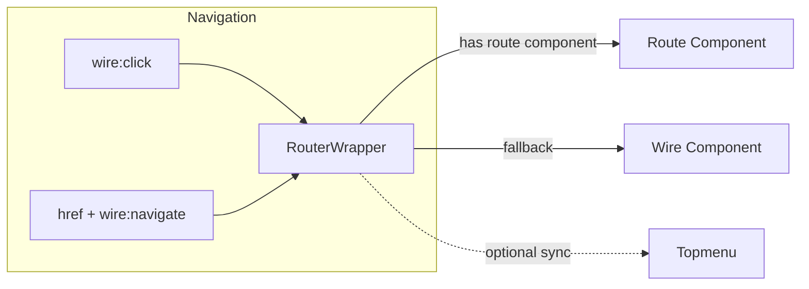

# Hybrid Routing System - Design Document (Simplified)

## Overview

A minimal hybrid routing system that allows both wire-based and route-based navigation to coexist. One wrapper, one route, query params for context.

## Architecture



## Components and Interfaces

### 1. RouterWrapper Component (Lean)

```php
// app/Livewire/Panel/RouterWrapper.php
namespace App\Livewire\Panel;

use Livewire\Component;
use App\Services\MenuCoordinator;

class RouterWrapper extends Component
{
    public ?string $routeComponent = null;
    public ?string $selectedWire = null;
    
    protected $listeners = ['wireSelected' => 'updateWire'];

    public function mount(?string $component = null)
    {
        $this->routeComponent = $component;
        $this->selectedWire = MenuCoordinator::getSelectedWire();
        
        // Sync menu context from query params if provided
        if ($component && request()->has('module')) {
            $this->dispatch('moduleSelected', (int) request()->query('module'));
        }
    }

    public function updateWire(string $wire): void
    {
        if (!$this->routeComponent) {
            $this->selectedWire = $wire;
        }
    }
    
    protected function getComponentKey(): string
    {
        $component = $this->routeComponent ?? $this->selectedWire ?? 'default';
        return ($this->routeComponent ? 'route-' : 'wire-') . md5($component);
    }

    public function render()
    {
        $component = $this->routeComponent ?? $this->selectedWire;
        
        return view('livewire.panel.router-wrapper', [
            'componentKey' => $this->getComponentKey(),
            'componentToRender' => $component,
        ]);
    }
}
```

### 2. RouterWrapper Blade View (Simple)

```blade
{{-- resources/views/livewire/panel/router-wrapper.blade.php --}}
<div class="flex-1 p-4">
    @if($componentToRender)
        @try
            @livewire($componentToRender, [], key($componentKey))
        @catch (\Exception $e)
            <div class="flex items-center justify-center h-64 text-center">
                <div>
                    <div class="text-red-500 mb-2">Component not found: {{ $componentToRender }}</div>
                    <a href="{{ route('dashboard') }}" class="text-blue-500 hover:underline">Back to Dashboard</a>
                </div>
            </div>
        @endcatch
    @else
        <div class="text-gray-500 text-center py-16">No content selected</div>
    @endif
</div>
```

### 3. Session Initialization Middleware (Minimal)

```php
// app/Http/Middleware/InitializeSessionDefaults.php
namespace App\Http\Middleware;

use Closure;
use Illuminate\Http\Request;
use Illuminate\Support\Facades\Auth;

class InitializeSessionDefaults
{
    public function handle(Request $request, Closure $next)
    {
        if (Auth::check()) {
            $user = Auth::user();
            
            // Initialize firm_id
            if (!session()->has('firm_id')) {
                $firm = $user->firms()->where('is_inactive', false)->first();
                session(['firm_id' => $firm?->id]);
            }
            
            // Initialize panel_id
            if (!session()->has('panel_id')) {
                $panel = $user->panels()->where('is_inactive', false)->where('panel_type', '2')->first();
                session(['panel_id' => $panel?->id]);
            }
            
            // Initialize default wire
            if (!session()->has('defaultwire')) {
                session(['defaultwire' => 'panel.dashboard']);
            }
        }
        
        return $next($request);
    }
}
```

### 4. Single Universal Route

```php
// routes/web.php - Add this ONE route

Route::get('/screen/{component}', function ($component) {
    return view('layouts.panel-screen', ['component' => $component]);
})
->where('component', '.*')
->middleware(['auth', 'initialize.session'])
->name('panel.screen');

// Usage examples:
// /screen/hrms.onboard.employees
// /screen/hrms.onboard.employees?module=2
// /screen/hrms.onboard.employees?module=2&app=3
```

### 5. Panel Screen Layout

```blade
{{-- resources/views/layouts/panel-screen.blade.php --}}
<x-layouts.app.sidebar>
    {{-- Component passed via route, RouterWrapper picks it up --}}
</x-layouts.app.sidebar>
```

### 6. Updated Sidebar Layout

```blade
{{-- resources/views/components/layouts/app/sidebar.blade.php --}}
{{-- Only change: Replace MainContent with RouterWrapper --}}

<!DOCTYPE html>
<html lang="{{ str_replace('_', '-', app()->getLocale()) }}" class="dark">
<head>
    @include('partials.head')
    <script type="text/javascript" src="https://www.gstatic.com/charts/loader.js"></script>
</head>
<body class="min-h-screen bg-white dark:bg-zinc-800 flex">
@livewire('panel.leftmenu')
<div class="flex-1 p-0 m-0">
    @livewire('panel.topbar')
    @livewire('panel.topmenu')
    <div class="p-0 m-0">
        @livewire('panel.router-wrapper', ['component' => request()->route('component')])
    </div>
</div>

@fluxScripts
@persist('toast')
<flux:toast position="top right"/>
@endpersist
@stack('scripts')
</body>
</html>
```

### 7. MenuCoordinator Addition (One Method)

```php
// Add to app/Services/MenuCoordinator.php

/**
 * Check if wire should use route-based navigation
 */
public static function isRouteBased(string $wire): bool
{
    // Add wires here as you migrate them
    $routeBasedWires = [
        // 'hrms.onboard.employees',
        // 'saas.agencies.index',
    ];
    
    return in_array($wire, $routeBasedWires);
}
```

## Migration: How to Convert a Screen

### Before (wire-based)
```blade
<flux:button wire:click="selectWire('hrms.onboard.employees')">
    Employees
</flux:button>
```

### After (route-based)
```blade
<flux:button 
    href="/screen/hrms.onboard.employees?module=2"
    wire:navigate>
    Employees
</flux:button>
```

That's it. One line change per menu item.

## Data Flow

### Wire-Based (Unchanged)
```
User clicks → Topmenu.selectWire() → dispatch('wireSelected') → RouterWrapper.updateWire() → Re-render
```

### Route-Based (New)
```
User clicks link → Browser navigates → Middleware runs → Layout loads → RouterWrapper.mount(component) → Render
```

## Error Handling

Let Livewire handle component errors naturally. The `@try/@catch` in the blade view catches rendering failures and shows a friendly message.

## Testing Strategy

### Manual Testing (Priority)
1. Click existing wire-based menu items → should work unchanged
2. Navigate to `/screen/hrms.onboard.employees` → should load component
3. Navigate to `/screen/invalid.component` → should show error message
4. Use browser back/forward → should work
5. Bookmark a route URL, close browser, reopen → should work

### Unit Tests (If Time Permits)
- RouterWrapper renders correct component in route mode
- RouterWrapper falls back to wire in wire mode
- Middleware initializes session values

## Files to Create/Modify

| File | Action |
|------|--------|
| `app/Livewire/Panel/RouterWrapper.php` | Create |
| `resources/views/livewire/panel/router-wrapper.blade.php` | Create |
| `app/Http/Middleware/InitializeSessionDefaults.php` | Create |
| `app/Http/Kernel.php` | Add middleware alias |
| `routes/web.php` | Add one route |
| `resources/views/layouts/panel-screen.blade.php` | Create |
| `resources/views/components/layouts/app/sidebar.blade.php` | Modify (swap MainContent → RouterWrapper) |
| `app/Services/MenuCoordinator.php` | Add `isRouteBased()` method |

## What We're NOT Doing

- ❌ Multiple route patterns
- ❌ Complex key generation with timestamps
- ❌ Component validation layer
- ❌ Session recovery logic in middleware
- ❌ Multiple MenuCoordinator routing methods
- ❌ Over-engineered context syncing
